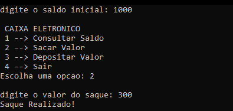

# Simulador de Sistema Bancário em C

## 📝 Descrição do Projeto
Este é um projeto prático desenvolvido como parte da disciplina de Engenharia de Software no UniCeub. O programa é um simulador de operações bancárias executado via linha de comando (CLI).

O objetivo principal deste projeto foi aplicar e consolidar os conceitos fundamentais de **Lógica de Programação** e desenvolvimento em **Linguagem C**.

## ⚙️ Funcionalidades
O sistema permite ao usuário realizar as seguintes operações interativas:
- **Consulta de Saldo:** Verificação do saldo atual da conta.
- **Depósito:** Adição de valores ao saldo da conta.
- **Saque:** Retirada de valores (com validação de saldo disponível).
- **Menu Interativo:** Loop de execução que mantém o programa rodando até o usuário escolher sair.

## 🚀 Tecnologias Utilizadas
- **Linguagem:** C
- **Conceitos aplicados:** Estruturas de controle (if/else, switch case), laços de repetição (while/do-while), funções e manipulação de variáveis.
---
### 💻 Acesse o Código:
**[👉 Clique aqui para ver o arquivo com o código fonte do Simulador](banco.c)**

## 👨‍💻 Autor
- Pedro Narriman

